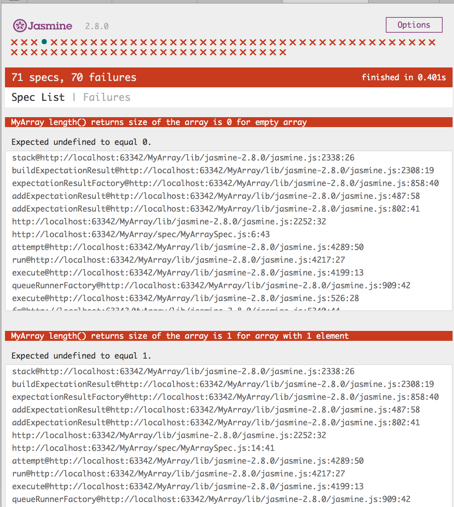

# Challenge “Build Your Own Array in Javascript!”

Rules are simple:

- I give you a test suite for (almost) all the functionality of the array.
- You implement that functionality in the class `MyArray`.
- You can’t use standard javascript’s `Array`, instead you need to use the provided wrapper `PlainArray` that limits what you can do:

```typescript
class PlainArray<T> {
    constructor(capacity: number)
    length: number
    get(index: number): T
    set(index: number, value: T)
}
```

- `PlainArray` is a fixed-size array that has one property and two methods defined: `length, get(index) and set(index, value)`.
- Even though the definition of that class is in Typescript, you will have to use vanilla ECMA Script 5.
- Focus more on readability over the performance.

## How to Run The Test Suite?

First, you’ll need to clone this repository:

```bash
$ git clone https://github.com/waterlink/Challenge-Build-Your-Own-Array-In-Js
$ cd Challenge-Build-Your-Own-Array-In-Js
```

You will need to open [`SpecRunner.html`](./SpecRunner.html) in your browser. You can launch it from the directory in your file explorer, or you could run it from terminal:

```bash
# Mac OS X:
$ open ./SpecRunner.html

# Most Linuxes
$ xdg-open ./SpecRunner.html
```

You should see something like that:



To see the test suite open [`./spec/MyArraySpec.js`](./spec/MyArraySpec.js) and start making these failing tests pass one by one.

I recommend starting with the top ones, as they get harder towards the bottom.

## Why?

So that you can practice your logical and problem-solving skills. 

Additionally, by the end of this challenge, you’ll have much more mastery over the use of arrays in javascript.

## I’m Done. Now What?

Send me a pull request to this GitHub repository. And take a look at everyone else’s solution, as well!

Just don’t peek before you are done ;)

## Thank you!